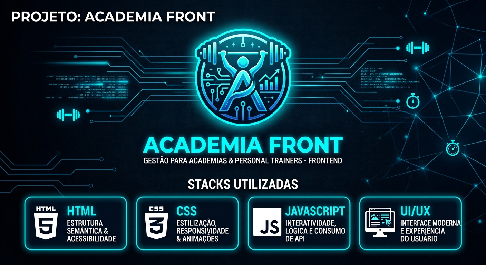

<p align="center">
  
</p>

<p align="center">
  <strong>Interface web para gerenciamento de fichas de treino, exercícios e vídeos.</strong>
</p>

<p align="center">
  
  
  
  
</p>

---

# 🏋️ Sobre o projeto

O **Academia Frontend** é uma aplicação web desenvolvida com **HTML, CSS e JavaScript** para interação com a API de gerenciamento de academias.

A aplicação permite que usuários realizem autenticação, criem suas contas e tenham acesso às suas fichas de treino, exercícios e vídeos demonstrativos.

O frontend foi desenvolvido com foco em uma experiência de uso simples, moderna e dinâmica, utilizando **animações e componentes interativos**.

---

# ✨ Funcionalidades

## 🔐 Autenticação

A aplicação possui um fluxo completo de entrada do usuário:

- 🔑 Login.
- 📝 Criação de conta.
- 🔐 Autenticação integrada à API.
- 👤 Gerenciamento da sessão do usuário.

---

## 📋 Fichas de treino

O usuário possui uma área dedicada às suas fichas de treino.

```text
                👤 USUÁRIO
                    │
                    ▼
             📋 MINHAS FICHAS
                    │
          ┌─────────┼─────────┐
          ▼         ▼         ▼
       🏋️ Ficha   🏋️ Ficha   🏋️ Ficha
          │         │         │
          ▼         ▼         ▼
      Exercícios  Exercícios  Exercícios
```

As fichas permitem organizar os exercícios de maneira estruturada para facilitar o acompanhamento do treinamento.

---

## 💾 Fichas salvas

O sistema possui uma área para visualizar as fichas que foram salvas pelo usuário.

Isso facilita o acesso aos treinos já cadastrados e permite que o usuário encontre rapidamente suas rotinas.

---

## 🎥 Vídeos dos exercícios

Os exercícios podem possuir vídeos demonstrativos.

```text
🏋️ Exercício
     │
     ▼
🎥 Vídeo demonstrativo
     │
     ▼
▶️ Execução do exercício
```

Os vídeos ajudam o usuário a compreender visualmente a execução dos exercícios presentes em sua ficha.

---

# 🎨 Interface e experiência

O projeto utiliza **HTML, CSS e JavaScript** para construir uma interface dinâmica.

Entre os recursos utilizados estão:

- ✨ Animações.
- 🖱️ Elementos interativos.
- 📱 Interface adaptável.
- 🎨 Componentes estilizados em CSS.
- ⚡ Atualização dinâmica de informações.
- 🔗 Integração com API REST.

---

# 🔗 Integração com a API

O frontend se comunica com o backend **Academia API**, desenvolvido em Java e Spring Boot.

```text
┌────────────────────────┐
│      🖥️ Academia       │
│       Frontend         │
│                        │
│ HTML + CSS + JavaScript│
└───────────┬────────────┘
            │
            │ HTTP / REST
            ▼
┌────────────────────────┐
│    ⚙️ Academia API     │
│                        │
│ Java + Spring Boot     │
└───────────┬────────────┘
            │
            ▼
       🐘 PostgreSQL
```

### ⚙️ Backend

O frontend foi desenvolvido para trabalhar em conjunto com:

**Academia API**

Java + Spring Boot + Spring Security + JWT + PostgreSQL

---

# 🔐 Autenticação

A aplicação utiliza autenticação integrada ao backend.

O fluxo básico é:

```text
📝 Cadastro
    │
    ▼
🔐 Login
    │
    ▼
🎫 Token JWT
    │
    ▼
🖥️ Aplicação
    │
    ▼
📋 Fichas e recursos protegidos
```

O token recebido durante a autenticação é utilizado para realizar requisições aos recursos protegidos da API.

---

# 🛠️ Tecnologias

| Tecnologia | Utilização |
|---|---|
| 🌐 HTML5 | Estrutura das páginas |
| 🎨 CSS3 | Estilização e animações |
| ⚡ JavaScript | Lógica e interatividade |
| 🔗 REST API | Comunicação com o backend |
| 🔐 JWT | Autenticação |
| 🖥️ Browser | Execução da aplicação |

---

# 🏗️ Arquitetura

A aplicação utiliza uma arquitetura frontend baseada na separação entre estrutura, apresentação e comportamento:

```text
             🖥️ FRONTEND
                  │
       ┌──────────┼──────────┐
       ▼          ▼          ▼
    HTML5       CSS3    JavaScript
       │          │          │
       └──────────┼──────────┘
                  ▼
             🌐 REST API
                  │
                  ▼
           ⚙️ BACKEND JAVA
                  │
                  ▼
            🐘 PostgreSQL
```

---

# 🚀 Como executar

## 📋 Pré-requisitos

Você precisa apenas de:

- Navegador moderno.
- Git.
- Backend da Academia API executando para utilizar as funcionalidades integradas.

---

## 1. Clone o repositório

```bash
git clone https://github.com/Heitor-Souza-Pacheco/academia-front.git
```

Entre na pasta:

```bash
cd academia-front
```

---

## 2. Configure a API

Localize o arquivo JavaScript responsável pela configuração/comunicação com a API.

Altere a URL base para o endereço em que a **Academia API** estiver executando.

Exemplo:

```javascript
const API_BASE_URL = "http://localhost:8080";
```

> A variável e o arquivo podem variar de acordo com a configuração atual do projeto.

---

## 3. Execute o frontend

Como o projeto utiliza HTML, CSS e JavaScript puro, pode ser executado diretamente no navegador.

Uma opção recomendada é utilizar o **Live Server** no VS Code.

1. Instale a extensão Live Server.
2. Abra o projeto no VS Code.
3. Clique com o botão direito no arquivo inicial da aplicação.
4. Selecione **Open with Live Server**.

---

# 📂 Estrutura do projeto

```text
academia-front/
│
├── assets/
│   └── academiafrontbanner.png
│
├── css/
│   └── ...
│
├── js/
│   └── ...
│
├── pages/
│   └── ...
│
├── index.html
├── cadastro.html
└── README.md
```

> A estrutura acima representa uma organização sugerida. Os nomes das pastas e arquivos podem variar conforme a implementação atual do projeto.

---

# 🧠 Conceitos praticados

Durante o desenvolvimento foram trabalhados conceitos importantes de desenvolvimento frontend:

- 🌐 HTML5.
- 🎨 CSS3.
- ⚡ JavaScript.
- 🔗 Consumo de APIs REST.
- 🔐 Autenticação JWT.
- 📡 Requisições HTTP.
- 🎨 Animações e transições.
- 🖱️ Interatividade.
- 🧩 Manipulação do DOM.
- 📋 Exibição dinâmica de dados.
- 🎥 Integração de vídeos.
- 🔄 Comunicação entre frontend e backend.

---

# 📚 Aprendizados

O desenvolvimento do projeto proporcionou experiência prática na criação de uma aplicação web integrada a um backend.

Entre os principais aprendizados estão:

- Desenvolvimento de interfaces utilizando HTML e CSS.
- Criação de interações com JavaScript.
- Consumo de APIs REST.
- Implementação de autenticação utilizando JWT.
- Manipulação dinâmica de dados.
- Criação de interfaces com animações.
- Organização de páginas e componentes.
- Integração entre frontend e backend.

---

# 🔮 Próximos passos

Possíveis evoluções para o projeto:

- [ ] Melhorar responsividade para dispositivos móveis.
- [ ] Adicionar mais animações e microinterações.
- [ ] Melhorar experiência de navegação.
- [ ] Adicionar filtros para fichas e exercícios.
- [ ] Adicionar busca de exercícios.
- [ ] Melhorar visualização dos vídeos.
- [ ] Criar dashboard com informações do usuário.
- [ ] Adicionar modo escuro.
- [ ] Implementar deploy completo da aplicação.
- [ ] Adicionar testes.

---

# 🔗 Projeto relacionado

O **Academia Frontend** faz parte de um sistema composto por frontend e backend:

### 🖥️ Frontend

**academia-front**

HTML + CSS + JavaScript

### ⚙️ Backend

**academia**

Java + Spring Boot + Spring Security + JWT + PostgreSQL

---

# 👨‍💻 Desenvolvedor

## Heitor Souza Pacheco

Estudante de Ensino Médio Técnico em Informática e desenvolvedor interessado em **desenvolvimento web, Java, Spring Boot, JavaScript e APIs REST**.

<p align="center">
  <a href="https://github.com/Heitor-Souza-Pacheco">
    
  </a>
  <a href="https://linkedin.com/in/heitor-souza-pacheco">
    
  </a>
</p>

---

<p align="center">
  ⭐ Se este projeto foi interessante, considere deixar uma estrela!
</p>
